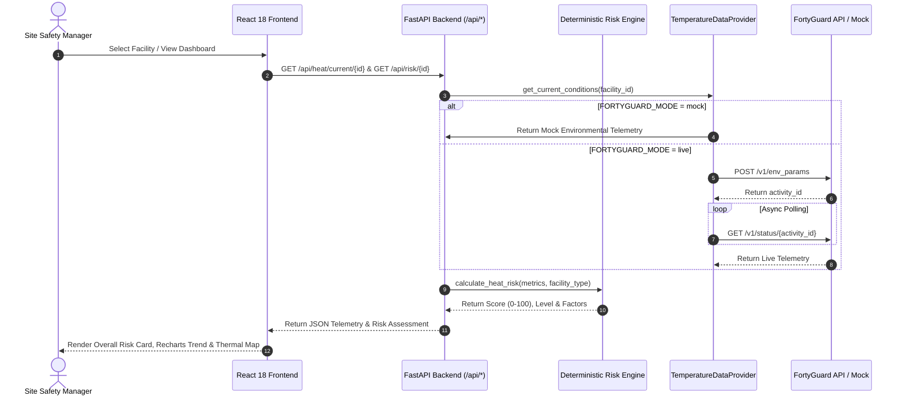

<div align="center">


# 🛡️ HeatShield AI
### *Enterprise Heat Risk Intelligence & Decision Support Platform*

[](https://docs-api.fortyguard.com/docs/introduction)
[](https://github.com/Farhan0629/HeatShield-AI)
[](https://docs-api.fortyguard.com/docs/introduction)
[](./LICENSE)

---

**HeatShield AI** is an intelligent operational heat-risk monitoring and decision-support platform built for **FortyGuard Hackathon '26 — Building the World's Temperature AI**. Instead of merely displaying raw environmental numbers, HeatShield AI synthesizes real-time FortyGuard environmental telemetry, executes a deterministic multi-vector risk engine, predicts thermal stress trends, provides grounded AI operational advice, and generates official incident reports to safeguard workforce safety and prevent industrial downtime.

[Explore Features](#-key-features) • [Architecture](#-system-architecture) • [Scoring Model](#-deterministic-risk-engine) • [API Docs](#-backend-api-reference) • [Setup Guide](#-quickstart--local-setup)

</div>

---

## 🚨 The Heat Risk Problem

Extreme heatwaves and urban thermal islands represent one of the fastest-growing industrial hazards worldwide:

- **Invisible Wet-Bulb Stress**: Standard weather dashboards only report dry-bulb air temperature, ignoring how relative humidity severely impairs human sweat dissipation.
- **Delayed Operational Decisions**: Facility and site managers lack real-time decision support, leading to late shift adjustments or preventable heat exhaustion incidents.
- **Unstructured Telemetry**: Raw sensor data provides numbers without actionable operational precautions (e.g. shift hydration break intervals or manual task rescheduling).

---

## 💡 The HeatShield AI Solution

HeatShield AI transforms environmental numbers into immediate, actionable enterprise safety decisions:

```
FortyGuard Environmental Telemetry (Temp, Heat Index, WBGT, AQI, Irradiance)
                             ↓
           HeatShield Deterministic Risk Engine (0-100 Score)
                             ↓
              Categorates Risk Level (SAFE | MODERATE | HIGH | CRITICAL)
                             ↓
     Context-Grounded AI Operational Assistant & Safety Precautions
                             ↓
         Real-Time Push Alerts & Official Executive Incident Reports (PDF)
```

---

## ✨ Key Features & Tier Breakdown

### 🎯 Tier 1 — Core Intelligence Engine

| Feature | Description | Status |
| :--- | :--- | :--- |
| **Operational Heat Dashboard** | Enterprise dashboard presenting overall heat risk score (`87 / 100 CRITICAL`), key environmental metrics grid, 12-hour thermal forecast, AI assessment banner, and facility risk table. | ✅ Active |
| **Facility Deep Dive** | Detailed asset monitoring page displaying capacity, shift exposure duration, active alerts, recommended precautions, and instant report triggers. | ✅ Active |
| **Interactive Thermal Heatmap** | High-resolution Leaflet map overlaying 80m spatial granularity GeoJSON thermal polygons around monitored facilities with interactive risk popups. | ✅ Active |
| **Deterministic Risk Engine** | Transparent scoring system analyzing Heat Index, WBGT, Air Temp, Exposure Duration, and Facility Vulnerability without LLM guesswork. | ✅ Active |
| **AI Operations Assistant** | ChatGPT-style conversational assistant grounded in live metrics that answers operational safety inquiries without hallucinating numbers. | ✅ Active |

### 📋 Tier 2 & Tier 3 — Enterprise Management

| Feature | Description | Status |
| :--- | :--- | :--- |
| **Facility Management Registry** | Multi-facility tracking system allowing creation, editing, and risk status monitoring for Warehouses, Construction Sites, Factories, Offices, Hospitals, and Schools. | ✅ Active |
| **Real-Time Alert Registry** | Filterable alert center supporting severity sorting (`CRITICAL`, `HIGH`, `MODERATE`), supervisor acknowledgment, and hazard resolution tracking. | ✅ Active |
| **Executive Report Generator** | On-demand decision support report builder generating structured document previews and instant downloadable PDF byte streams. | ✅ Active |
| **System Settings & Isolation** | Status dashboard monitoring `FORTYGUARD_MODE` (`mock` vs `live`), AI provider status, and secret credential protection. | ✅ Active |

---

## 🛰️ FortyGuard Environmental Telemetry Matrix

HeatShield AI ingests 7 atmospheric and thermal parameters specified in the official FortyGuard Enterprise API documentation:

| Parameter | Unit | Symbol | Operational Safety Threshold |
| :--- | :---: | :---: | :--- |
| **Ambient Air Temperature** | °C | $T_{air}$ | Baseline 30°C — Critical above 42°C |
| **Apparent Heat Index** | °C | $HI$ | Perceived thermal burden (combines temp & moisture) |
| **Wet Bulb Temperature** | °C | $WBGT$ | Sweating dissipation limit (Critical above 30°C) |
| **Relative Humidity** | % | $RH$ | Moisture content retarding cooling |
| **Air Quality Index (AQI)** | Index | $AQI$ | Particulate & pollutant exposure burden |
| **Solar Irradiance (GHI)** | W/m² | $GHI$ | Direct radiant solar load |
| **Wind Speed** | km/h | $V_{wind}$ | Convective cooling assistance |

---

## 🧮 Deterministic Risk Engine

The **HeatShield Risk Engine** (`backend/app/services/risk_engine.py`) uses a transparent mathematical scoring model (*HeatShield Risk Model — Prototype*) to ensure identical environmental inputs produce deterministic risk scores:

$$\text{Raw Score} = (HI \times 0.30) + (WBGT \times 0.25) + (T_{air} \times 0.20) + (\text{Shift Exp} \times 0.15) + (RH \times 0.10)$$

$$\text{Final Risk Score} = \min\left(100, \text{Raw Score} \times \text{Facility Vulnerability Multiplier}\right)$$

### Facility Vulnerability Multipliers
- **Construction Site (Outdoor Direct Sun)**: `1.25x`
- **Factory (High Industrial Exertion)**: `1.15x`
- **Warehouse (Partial Evaporative Cooling)**: `1.10x`
- **School / Hospital**: `1.05x`
- **Office Campus (Central HVAC)**: `0.85x`

### Risk Classifications
- **80.0 – 100.0**: 🔴 `CRITICAL` (Mandatory 15-min rest cycles per hour, halt heavy manual labor)
- **60.0 – 79.9**: 🟠 `HIGH` (Increase hydration breaks, shift non-essential outdoor work)
- **40.0 – 59.9**: 🟡 `MODERATE` (Monitor shift fatigue, optimize auxiliary fan ventilation)
- **0.0 – 39.9**: 🟢 `SAFE` (Normal operational heat profile)

---

## 🏗️ System Architecture



---

## 🔌 Backend API Reference

All backend endpoints are built using FastAPI with full OpenAPI validation schemas:

| Method | Endpoint | Description |
| :--- | :--- | :--- |
| `GET` | `/api/health` | Health check & FortyGuard connection status |
| `GET` | `/api/facilities` | List all registered facilities |
| `POST` | `/api/facilities` | Register new facility asset |
| `GET` | `/api/heat/current/{facility_id}` | Retrieve real-time atmospheric telemetry |
| `GET` | `/api/heat/forecast/{facility_id}?hours=12` | Retrieve 12-hour hourly forecast & peak time |
| `GET` | `/api/heat/heatmap/{facility_id}` | Retrieve GeoJSON thermal polygon zones |
| `GET` | `/api/risk/{facility_id}` | Calculate deterministic operational risk score |
| `POST` | `/api/ai/chat` | Context-grounded operational AI chat assistant |
| `GET` | `/api/alerts` | List thermal threshold hazard alerts |
| `POST` | `/api/alerts/{id}/acknowledge` | Acknowledge active risk alert |
| `POST` | `/api/alerts/{id}/resolve` | Mark risk hazard resolved |
| `POST` | `/api/reports/generate` | Generate structured executive report JSON |
| `POST` | `/api/reports/pdf` | Download official executive report as PDF byte stream |

---

## 💻 Quickstart & Local Setup

### Prerequisites
- **Node.js** v18+ & npm
- **Python** 3.10+

### 1. Backend Setup
```bash
# Navigate to backend directory
cd backend

# Create virtual environment
python -m venv venv

# Activate virtual environment
# Windows PowerShell:
.\venv\Scripts\Activate.ps1
# macOS/Linux:
source venv/bin/activate

# Install dependencies
pip install -r requirements.txt

# Start FastAPI server
python -m uvicorn app.main:app --reload --port 8000
```
- API Endpoint: `http://localhost:8000/api`
- Interactive Swagger UI: `http://localhost:8000/docs`

### 2. Run Backend Verification Test Suite
```bash
cd backend
python test_api.py
```

### 3. Frontend Setup
```bash
# Navigate to frontend directory
cd frontend

# Install npm packages
npm install

# Start Vite development server
npm run dev
```
- Web Application UI: `http://localhost:5173`

---

## 🌐 Environment Variables

Create `.env` in `backend/`:

```env
# Provider Mode: "mock" (default for hackathon demo) or "live"
FORTYGUARD_MODE=mock

# FortyGuard Enterprise API Credentials (used when FORTYGUARD_MODE=live)
FORTYGUARD_API_KEY=
FORTYGUARD_BASE_URL=https://api.fortyguard.com/v1

# AI Provider Configuration: "mock" or "openai" / "anthropic" / "gemini"
AI_PROVIDER=mock
AI_API_KEY=

# Server Configuration
HOST=0.0.0.0
PORT=8000
ALLOWED_ORIGINS=http://localhost:5173,http://127.0.0.1:5173
```

---

## ⚡ FortyGuard Live Integration Architecture

The live provider class (`backend/app/services/providers/fortyguard.py`) strictly adheres to the official [FortyGuard API Documentation](https://docs-api.fortyguard.com/docs/introduction):

1. **Authentication**: `api-key: YOUR_API_KEY` header.
2. **Asynchronous Polling Protocol**:
   - `POST /v1/env_params` $\rightarrow$ returns `activity_id`
   - `POST /v1/heatmap` $\rightarrow$ returns `activity_id`
   - `GET /v1/status/{activity_id}` $\rightarrow$ polls status until task reaches `completed`.
3. **Zero-Code Switch**: Set `FORTYGUARD_MODE=live` and supply your key in `.env`.

---

## 🔒 Security & Disclaimers

- **Secret Key Protection**: All secret keys remain isolated in server environment variables. Zero API credentials are exposed in frontend client bundles.
- **Operational Advisory**: Safety recommendations issued by HeatShield AI represent operational precautions and non-medical advisories.

---

<div align="center">

Developed for **FortyGuard Hackathon '26 — Building the World's Temperature AI**

</div>
