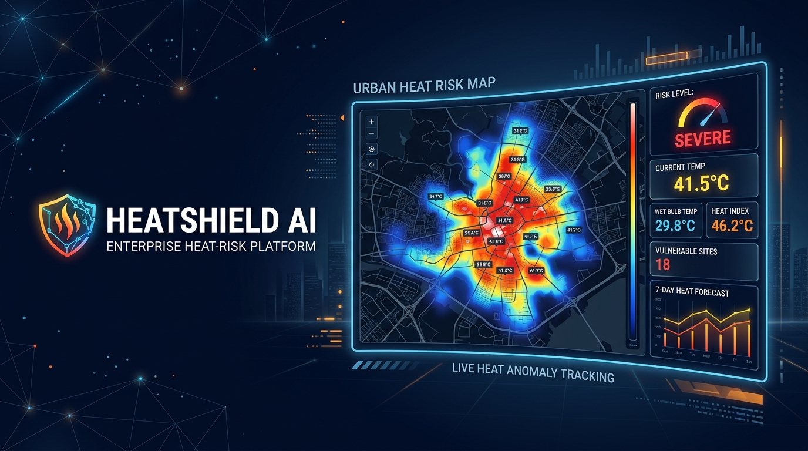
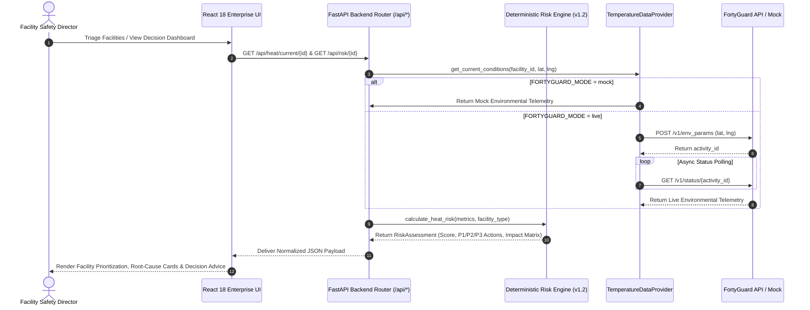

<div align="center">



# 🛡️ HeatShield AI
### *Enterprise Heat Risk Intelligence & Operational Decision Support Platform*

[](https://docs-api.fortyguard.com/docs/introduction)
[](https://github.com/Farhan0629/HeatShield-AI)
[](https://docs-api.fortyguard.com/docs/introduction)
[](https://github.com/Farhan0629/HeatShield-AI)
[](./LICENSE)

---

**HeatShield AI** is an intelligent operational heat-risk monitoring and decision-support platform engineered for **FortyGuard Hackathon '26 — Building the World's Temperature AI**. Instead of functioning as a simple passive weather dashboard, HeatShield AI synthesizes real-time FortyGuard environmental telemetry, executes a deterministic multi-vector risk engine, predicts micro-climate thermal exceedance windows, delivers prioritized operational precautions (P1/P2/P3), evaluates facility operational impacts, and generates certified executive incident reports to protect workforce health and prevent industrial downtime.

[Core Paradigm](#-operational-intelligence-pipeline) • [Monitored Fleet](#-monitored-enterprise-portfolio) • [Scoring Model](#-deterministic-risk-engine) • [Key Features](#-enterprise-feature-matrix) • [API Reference](#-backend-api-reference) • [Setup & Live Integration](#-quickstart--local-setup)

</div>

---

## 🚨 The Heat Risk Problem

Extreme heatwaves and urban thermal islands represent one of the fastest-growing industrial hazards across the global economy:

- **Invisible Wet-Bulb Stress**: Standard weather dashboards only report dry-bulb air temperature, completely ignoring how ambient moisture retards human sweat dissipation.
- **Delayed Operational Decisions**: Facility and safety directors lack real-time decision support, leading to delayed shift pacing adjustments, emergency hospitalizations, and costly downtime.
- **Unstructured Sensor Telemetry**: Raw sensor numbers do not communicate actionable operational directives (e.g., specific rest-to-work cycle durations, HVAC pre-cooling intervals, or high-exertion task rescheduling).

---

## 💡 The Operational Intelligence Pipeline

HeatShield AI operationalizes environmental numbers into immediate, auditable enterprise safety directives:

```
FortyGuard Environmental Telemetry (Temp, Heat Index, WBGT, AQI, Irradiance, Wind)
                                      ↓
           HeatShield Deterministic Risk Engine (Enterprise Model v1.2)
                                      ↓
        Categorizes Risk Level (SAFE | MODERATE | HIGH | CRITICAL)
                                      ↓
           ┌──────────────────────────┼──────────────────────────┐
           ↓                          ↓                          ↓
    Why This Risk?           Prioritized Actions        Operational Impact
 (Root-Cause Drivers)       (P1/P2/P3 Directives)      (5 Facility Vectors)
           └──────────────────────────┬──────────────────────────┘
                                      ↓
        Context-Grounded AI Decision Assistant & Live Micro-Climate Heatmap
                                      ↓
       Real-Time Push Alerts & Official Executive Decision Reports (PDF)
```

---

## 🏢 Monitored Enterprise Portfolio (US Coverage)

Aligned with the FortyGuard Hackathon US data coverage, HeatShield AI monitors regional enterprise facilities spanning varied climates and exposure profiles:

| Facility Asset | Location | Facility Type | Current Temp / Heat Index | Risk Status | Primary Operational Focus |
| :--- | :--- | :--- | :---: | :---: | :--- |
| **Dallas Construction Hub** | Dallas, TX | Construction Site | **39.6°C / 47.2°C** | 🔴 `CRITICAL (91/100)` | Direct solar exposure; halt heavy structural crane lifts during peak. |
| **Phoenix Logistics Center** | Phoenix, AZ | Distribution Warehouse | **42.8°C / 46.5°C** | 🔴 `CRITICAL (89/100)` | Extreme desert heat; deploy HVLS spot fans on loading dock bays. |
| **Austin Operations Campus** | Austin, TX | Office & Labs | **34.2°C / 39.8°C** | 🟡 `MODERATE (56/100)` | High chiller thermal load; pre-cool interior zones ahead of peak. |
| **Seattle Regional Fulfillment**| Seattle, WA | Automated Logistics | **24.5°C / 25.2°C** | 🟢 `SAFE (28/100)` | Nominal baseline envelope; normal operational workflows. |

---

## ✨ Enterprise Feature Matrix

### 🎯 1. Operational Heat Intelligence & Hierarchy
- **Enterprise Multi-Facility Risk Prioritization**: Live triage board ranking monitored facilities by thermal urgency with 1-click facility switching.
- **Why This Risk? Root-Cause Intelligence**: Concise, factual breakdown of underlying thermodynamic drivers (Heat Index, Wet Bulb sweat limit, continuous threshold exceedance).
- **Prioritized Action Recommendations (P1/P2/P3)**:
  - `P1 - Immediate`: Shift restructuring, mandatory 15-min rest cycles, and task rescheduling.
  - `P2 - High`: Spot cooling deployment, AHU economizer adjustments, and hydration pacing.
  - `P3 - Standard`: Baseline monitoring, buddy checks, and SMS supervisor alerts.
  - *Includes explicit Action, Reason, and Quantified Operational Benefit tags.*
- **5-Dimensional Operational Impact Matrix**:
  1. *Personnel Heat Exposure*
  2. *Facility Cooling Infrastructure Demand*
  3. *Outdoor & Unconditioned Work Hazard*
  4. *Equipment Thermal Overload Stress*
  5. *Operational Disruption / Pacing Risk*

### 🗺️ 2. Hyperlocal Temperature Intelligence & Thermal Map
- **80m Granularity Leaflet Heatmap**: Dynamic GeoJSON polygons displaying localized thermal micro-climates, heat island cores, and buffer zones.
- **Micro-Climate Anomaly ($\Delta T$)**: Real-time urban heat island differential tracking above regional baseline temperatures.
- **12-Hour Thermal Forecast Projection**: Hour-by-hour heat index, wet bulb, and risk score progression highlighting peak hazard windows (e.g. `13:30 – 16:30`).

### 🤖 3. Grounded AI Decision Assistant
- **Deterministic Multi-Facility Reasoning**: Conversational decision support answering:
  - *"Which facility is currently at greatest heat risk?"*
  - *"Why is Phoenix at critical risk?"*
  - *"What actions should we take right now?"*
  - *"When is the peak thermal period expected?"*
  - *"Summarize today's heat situation across all facilities."*
  - *"What is the operational impact on cooling and equipment?"*
- Zero hallucination risk; answers strictly grounded in active telemetry with zero external API key requirements.

### 📋 4. Enterprise Compliance & Reports
- **Executive Decision Reports**: Structured incident documentation with instant downloadable **binary PDF stream** exports.
- **Real-Time Alerts Registry**: Acknowledge, resolve, and audit active hazard triggers across all locations.
- **Data Source Transparency Badge**: Clear visual indicator displaying `DATA SOURCE: Demo Simulation (FortyGuard Schema Aligned)` in demo mode and `FortyGuard Live API` in production mode.

---

## 🧮 Deterministic Risk Engine Specification

The **HeatShield Risk Engine** (`backend/app/services/risk_engine.py`) implements *HeatShield Risk Model — Enterprise v1.2*, ensuring reproducible, auditable operational scoring:

$$\text{Raw Score} = (HI \times 0.30) + (WBGT \times 0.25) + (T_{air} \times 0.20) + (\text{Shift Exp} \times 0.15) + (RH \times 0.10)$$

$$\text{Final Operational Risk Score} = \min\left(100, \text{Raw Score} \times \text{Facility Vulnerability Multiplier}\right)$$

### Facility Vulnerability Multipliers
- **Construction Site (Outdoor Direct Sun)**: `1.25x`
- **Industrial Factory (High Internal Heat Exertion)**: `1.15x`
- **Warehouse / Logistics (Partial Evaporative Staging)**: `1.10x`
- **Educational / Hospital Campus**: `1.05x`
- **Office / Tech Campus (Central Climate Control)**: `0.85x`

### Risk Classification Tiers
- **80.0 – 100.0**: 🔴 `CRITICAL` — Mandatory 15-minute cool rest breaks per 45 minutes; halt heavy manual labor during peak window.
- **60.0 – 79.9**: 🟠 `HIGH` — Enforce hydration intervals; shift non-essential outdoor work away from peak afternoon hours.
- **40.0 – 59.9**: 🟡 `MODERATE` — Pre-cool indoor facilities; monitor chiller loads and auxiliary ventilation.
- **0.0 – 39.9**: 🟢 `SAFE` — Normal baseline operational envelope.

---

## 🛰️ FortyGuard Environmental Telemetry Ingestion

HeatShield AI normalizes 7 core environmental parameters specified in the official FortyGuard documentation:

| Parameter | Unit | Symbol | Operational Threshold & Impact |
| :--- | :---: | :---: | :--- |
| **Ambient Air Temperature** | °C | $T_{air}$ | Baseline 28°C — Hazardous above 40°C |
| **Apparent Heat Index** | °C | $HI$ | Combined temperature and humidity perceived thermal burden |
| **Wet Bulb Temperature** | °C | $WBGT$ | Sweating dissipation limit (Severe impairment above 29°C) |
| **Relative Humidity** | % | $RH$ | Atmospheric moisture restricting convective cooling |
| **Air Quality Index (AQI)** | Index | $AQI$ | Particulate & ozone burden compounding respiratory strain |
| **Solar Irradiance (GHI)** | W/m² | $GHI$ | Direct radiant solar load on outdoor workforce |
| **Wind Speed** | km/h | $V_{wind}$ | Convective air movement assistance |

---

## 🏗️ System Architecture



---

## 🔌 Backend API Reference

| Method | Endpoint | Description |
| :--- | :--- | :--- |
| `GET` | `/api/health` | System health check & FortyGuard connection status |
| `GET` | `/api/facilities` | List all monitored enterprise facilities |
| `POST` | `/api/facilities` | Register new facility asset |
| `GET` | `/api/facilities/{id}` | Get specific facility details |
| `GET` | `/api/heat/current/{facility_id}` | Retrieve real-time 7-parameter environmental telemetry |
| `GET` | `/api/heat/forecast/{facility_id}?hours=12` | Retrieve 12-hour hourly forecast & peak thermal window |
| `GET` | `/api/heat/heatmap/{facility_id}` | Retrieve GeoJSON thermal polygon zones |
| `GET` | `/api/risk/{facility_id}` | Calculate deterministic risk assessment & recommendations |
| `POST` | `/api/ai/chat` | Query the grounded Heat Risk Decision Assistant |
| `GET` | `/api/alerts` | List active thermal hazard alerts |
| `POST` | `/api/alerts/{id}/acknowledge` | Acknowledge active alert |
| `POST` | `/api/alerts/{id}/resolve` | Mark thermal alert resolved |
| `POST` | `/api/reports/generate` | Generate structured executive report JSON |
| `POST` | `/api/reports/pdf` | Download official executive decision report as PDF byte stream |

---

## 💻 Quickstart & Local Setup

### Prerequisites
- **Node.js** v18+ & npm
- **Python** 3.10+

### 1. Backend Setup
```bash
# Navigate to backend directory
cd backend

# Create virtual environment
python -m venv venv

# Activate virtual environment
# Windows:
.\venv\Scripts\Activate.ps1
# macOS/Linux:
source venv/bin/activate

# Install dependencies
pip install -r requirements.txt

# Start FastAPI server
python -m uvicorn app.main:app --reload --port 8000
```
- API Root: `http://localhost:8000/api/health`
- Interactive OpenAPI Docs: `http://localhost:8000/docs`

### 2. Run Test Suite
```bash
cd backend
python test_api.py
```

### 3. Frontend Setup
```bash
# Navigate to frontend directory
cd frontend

# Install dependencies
npm install

# Start Vite development server
npm run dev
```
- Web Application: `http://localhost:5173`

---

## ⚡ Connecting the Official FortyGuard API

When your official FortyGuard API key is issued during the hackathon:

1. Open `backend/.env` (or copy from `backend/.env.example`).
2. Update the configuration flags:
   ```env
   FORTYGUARD_MODE=live
   FORTYGUARD_API_KEY=YOUR_OFFICIAL_API_KEY
   FORTYGUARD_BASE_URL=https://api.fortyguard.com/v1
   ```
3. Restart the FastAPI server:
   ```bash
   python -m uvicorn app.main:app --reload --port 8000
   ```
4. **Zero Code Changes Required**: The `FortyGuardProvider` class (`backend/app/services/providers/fortyguard.py`) automatically executes the asynchronous polling protocol (`POST /v1/env_params`, `POST /v1/heatmap`, and `GET /v1/status/{id}`) and normalizes responses into the HeatShield Risk Engine.

---

## 🔒 Security & Compliance Disclaimers

- **Credential Isolation**: All API keys remain isolated in server environment variables. Zero credentials exist in client bundles.
- **Operational Safety Advisory**: Recommendations generated by HeatShield AI represent operational shift management and facility engineering precautions, not medical advice.

---

<div align="center">

**HeatShield AI** — Built for **FortyGuard Hackathon '26: Building the World's Temperature AI**

</div>
